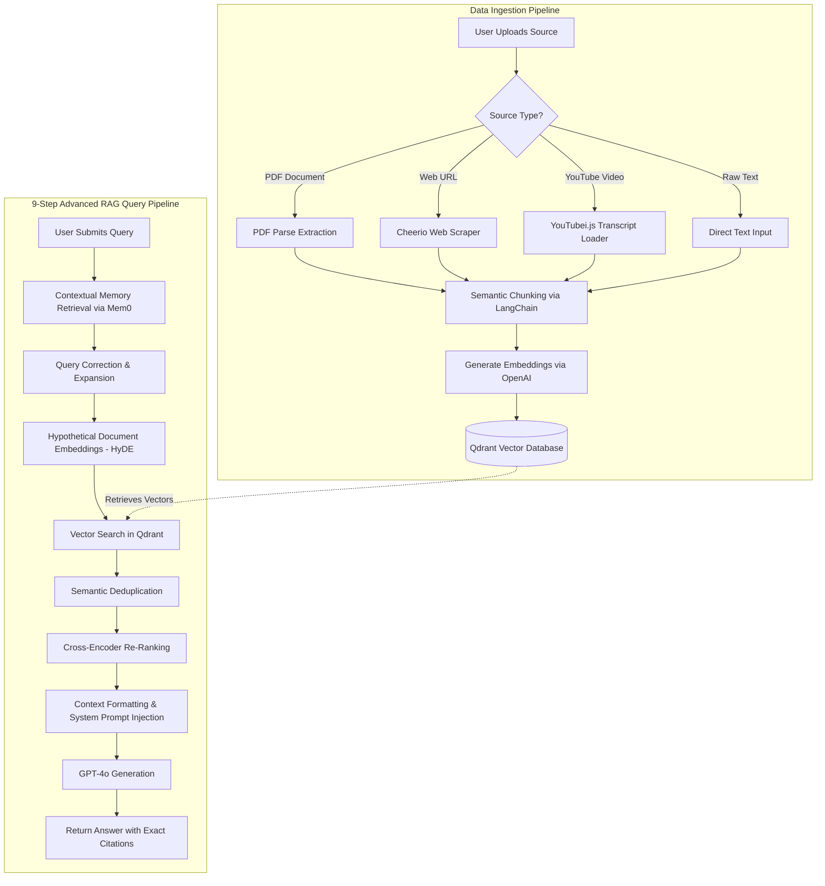

# ThinkNote AI

ThinkNote AI is a powerful, AI-driven personal notebook application that empowers users to seamlessly ingest, process, and query massive amounts of varied data sources (PDFs, Web Pages, YouTube Videos, and Raw Text) using an Advanced Retrieval-Augmented Generation (RAG) pipeline. Designed with a sleek SaaS aesthetic and enterprise-grade tools, this app acts as a "second brain," connecting concepts precisely and citing its sources instantly.

## 🚀 Key Features

- **Omni-Channel Imports:** Import data directly from PDFs, YouTube URLs, websites, and text snippets.
- **Advanced RAG Chat:** Chat with your documents. GPT-4o provides meticulously cited answers based *strictly* on your ingested sources.
- **Auto-Generated Quizzes:** Instantly turn any notebook into a 10-question multiple-choice quiz for active recall and studying.
- **Long-Term AI Memory:** Powered by Mem0, the assistant persistently remembers your unique facts and preferences securely across all your notebooks globally.
- **Live Web Search:** Conduct external research live and inject it directly into your notes.

---

## 🛠 Technology Stack

### Frontend (Client)
- **Framework:** React.js (Vite)
- **Routing:** React Router DOM
- **Styling:** Tailwind CSS (with utility libraries like `clsx` and `tailwind-merge`)
- **Icons:** Lucide React
- **HTTP Client:** Axios
- **Markdown Rendering:** `react-markdown`, `rehype-raw`, `remark-gfm`

### Backend (Server)
- **Runtime:** Node.js
- **Framework:** Express.js
- **Database:** MongoDB (via Mongoose)
- **Vector Database:** Qdrant (via `@qdrant/js-client-rest`)
- **AI / LLMs:** OpenAI API (`gpt-4o`, `text-embedding-3-small`)
- **Memory Management:** Mem0 (`mem0ai`)
- **Processing / Chunking:** LangChain (`langchain`, `@langchain/textsplitters`, etc.)
- **Data Loaders:** `pdf-parse`, `cheerio`, `youtubei.js`
- **Authentication:** JSON Web Tokens (JWT), `bcryptjs`
- **File Uploads:** Multer

---

## 🔀 Workflow & Architecture Flowchart

Below is the visual workflow for both Phase 1 (Data Ingestion) and Phase 2 (Querying & Chat execution):



---

## 💻 Installation & Setup Process

Follow these instructions to run ThinkNote AI locally on your machine.

### Prerequisites
Make sure you have the following installed:
- [Node.js](https://nodejs.org/en/) (v16.x or newer)
- [MongoDB](https://www.mongodb.com/) (Local or Atlas URI)
- [Qdrant](https://qdrant.tech/) (Local Docker container or Cloud Cluster URI)
- [OpenAI API Key](https://platform.openai.com/)
- [Mem0 API Key](https://mem0.ai/)

### 1. Clone the repository
```bash
git clone https://github.com/your-username/thinknote-ai.git
cd thinknote-ai
```

### 2. Backend Setup
Navigate into the `server` directory and install dependencies:
```bash
cd server
npm install
```

Create a `.env` file in the `server` directory and supply your credentials:
```env
PORT=3000
MONGODB_URI=your_mongodb_connection_string
JWT_SECRET=your_jwt_secret_key
OPENAI_API_KEY=your_openai_api_key
QDRANT_URL=your_qdrant_cluster_url
QDRANT_API_KEY=your_qdrant_api_key
MEM0_API_KEY=your_mem0_api_key
```

Start the backend development server:
```bash
npm run dev
```
*The server will start on `http://localhost:3000`.*

### 3. Frontend Setup
Open a new terminal window, navigate to the `client` directory, and install dependencies:
```bash
cd ../client
npm install
```

Create a `.env` file in the `client` directory:
```env
VITE_API_URL=http://localhost:3000
```

Start the frontend development server:
```bash
npm run dev
```
*The client will start on `http://localhost:5173` (or the port Vite provides).*

### 4. Access the Application
Open your browser and navigate to `http://localhost:5173`. You can now sign up, create notebooks, and begin uploading documents!
